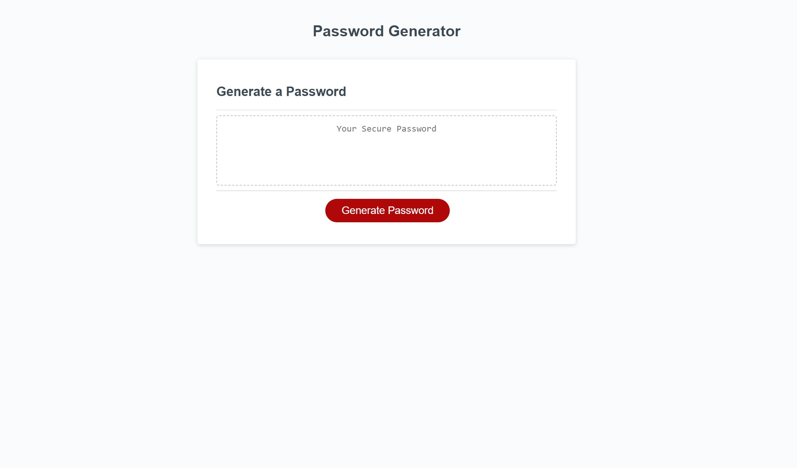

# Password Plug
If you need a password I gotchu!

## Introduction

Creating a working password generator helped me gain more experience and exposure to using "conditions", "functions" along with a better understanding of how "calling" a "function" works.   Although this is still alot of information to take in this class, im still motivated to push myself to learn more with weekly challenges like these.  So with this completed you can now create a random secure password for yourself thats hard to crack!

## Installation

"N/A""

## Usage
https://xkranze.github.io/password-plug/
 

## Credits
-Bootcamp class
-Stack Overflow
-Youtube

